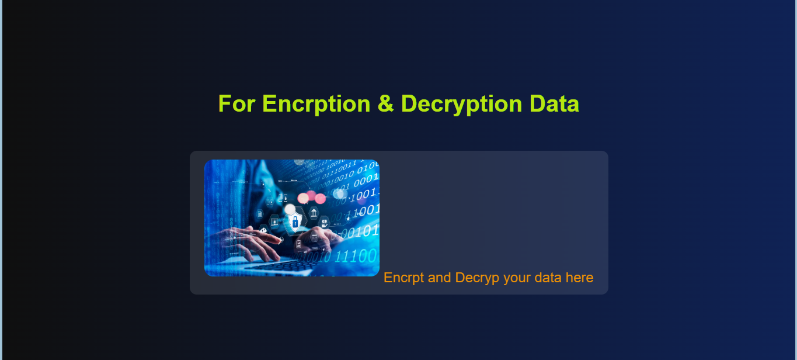

🔒 Text Encryption and Decryption Tool
Welcome to the Text Encryption and Decryption Tool – a simple yet powerful project that ensures the security and confidentiality of your text data by encrypting and decrypting it using modern cryptographic techniques.

🚀 Features
Secure Text Encryption
➔ Instantly encrypt any text input using secure algorithms.
Instant Decryption
➔ Easily decrypt the encrypted text back to its original form.
User-Friendly Interface
➔ Minimalistic design for quick and easy usage.
Cross-Platform
➔ Works on any modern web browser or system.

🛠️ Tech Stack
Frontend: HTML, CSS, JavaScript
Encryption Algorithm: AES (Advanced Encryption Standard) / Base64 / Custom methods (depends on your implementation)

📚 How To Use
Clone the repository

bash
Copy
Edit
git clone https://github.com/your-username/your-repository-name.git
Run the Frontend

Open the index.html file directly in your browser
or

Use a local server (like Live Server extension) for better performance.

Usage

Enter the text you want to encrypt ➔ Click Encrypt ➔ Copy the encrypted result.

To decrypt, paste the encrypted text ➔ Click Decrypt ➔ Get your original text back.

🔐 How It Works (Simple Overview)
Encryption:
User enters plain text.
Text is encrypted using [chosen algorithm, e.g., AES].
Output is secure cipher text.
Decryption:
User enters cipher text.
Tool decrypts it using the correct key or method.
Original text is retrieved securely.

🎯 Future Enhancements
Add option to choose different encryption algorithms (AES, RSA, etc.)
Password-protected encryption keys.
Save encrypted messages securely.
Generate QR codes for encrypted texts.

🤝 Contribution
Feel free to fork this repository and contribute!
New ideas, improvements, and feature additions are welcome! 🚀

📬 Contact
Email: eng.harshvishwakarma1737@gmail.com
LinkedIn: http://www.linkedin.com/in/harsh-vishwakarma-1141a128b

🔥 Secure Your Text – Encrypt Before You Share! 🔥
